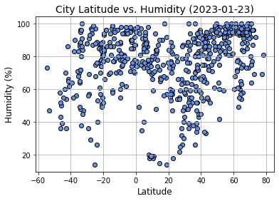
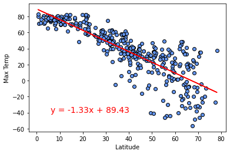
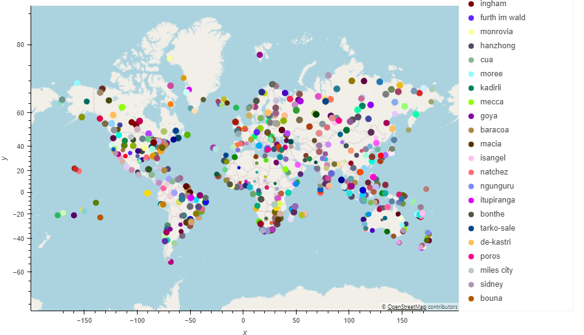
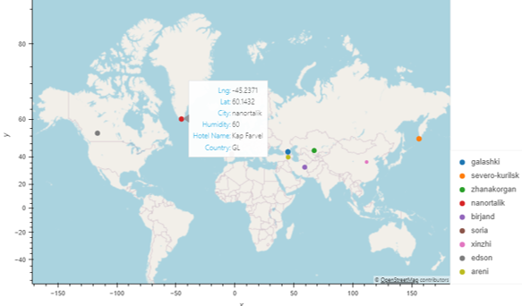

# Weather and possible holiday destinations

### **Overview**
Using the [OpenWeatherMap API](https://openweathermap.org/api) retrieved data to better understand the relationship between weather variables and latitude and plan future vacations with this and [hotel data](https://www.geoapify.com/geocoding-api?gclid=CjwKCAjwgqejBhBAEiwAuWHioC6hFOGxHoCRs0KZLWELMxnULEudo2_Ptf8bx-2U1KRCpNkXJF47yBoChqIQAvD_BwE)

### **Aspects Covered**
- Using API's to obtain data
- Looking at relationships using linear regression
- Adding files to a .gitignore file
- Creating maps containing additional data and functionality 

### **Visualisations**

City and humidity (size of point corresponds to humidity)

Potential holiday destinations (with the preferred temperature and humidity levels)

### **Folder structure**
There are two folders
- WeatherPy - code and output for the weather aspect
- VacationPy - code and output for possible vacation destinations

 

---

### **Contact**
Email: kymcoleman@gmail.com

---